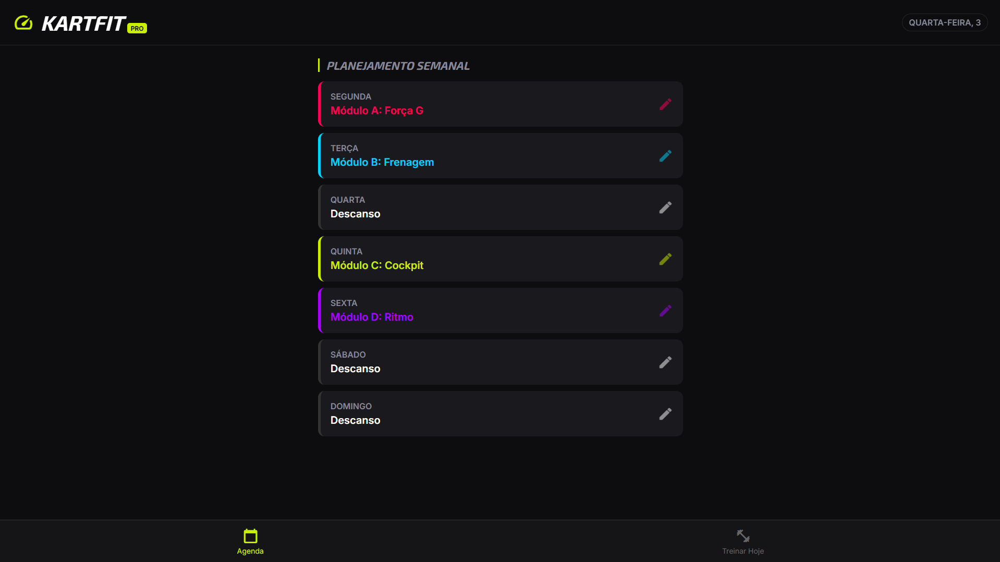
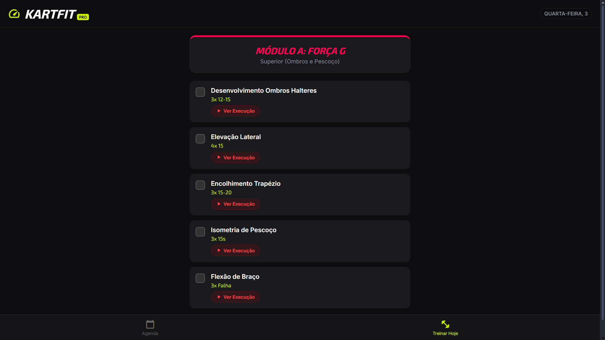

🏎️ KartFit Pro - Driver Performance Manager
KartFit Pro é uma aplicação web focada no gerenciamento e periodização de treinos físicos específicos para pilotos de Kart. O objetivo é substituir planilhas complexas por uma interface mobile-first, limpa e direta, permitindo que o piloto foque no que importa: baixar o tempo de volta.

"Não buscamos apenas hipertrofia, buscamos resistência à Força G, 'patada' de freio e reflexo."

<a href="https://danilo-vicentin-silva.github.io/KartFit/" target="_blank"> Acesse clicando aqui </a>

📱 Screenshots

   

🛠️ Funcionalidades
📅 Planejamento Semanal (Planner): Interface intuitiva para distribuir os módulos de treino durante a semana.

🧠 Módulos de Treino Pré-definidos:

Módulo A (Força G): Foco em pescoço e ombros.

Módulo B (Frenagem): Explosão de pernas e estabilidade.

Módulo C (Cockpit): Core (anti-rotação) e Pegada (evitar arm pump).

Módulo D (Ritmo): Cardio HIIT e Reflexos.

▶️ Integração Inteligente com YouTube: O app gera links de busca dinâmica para cada exercício, facilitando a consulta da execução correta.

💾 Persistência de Dados: Uso de LocalStorage para salvar a agenda e o progresso do usuário sem necessidade de backend.

📆 Detecção Automática de Dia: Ao abrir a aba "Treinar", o app identifica o dia da semana e carrega o treino correspondente.

💻 Tecnologias Utilizadas
O projeto foi construído com Vanilla JavaScript (sem frameworks) para demonstrar domínio dos fundamentos da linguagem e manipulação do DOM.

HTML5 Semântico

CSS3 Moderno (Variables, Flexbox, Grid, Animations)

JavaScript ES6+

⚙️ Arquitetura e Decisões de Código
Este projeto segue o conceito de SPA (Single Page Application) simplificada:

State Management: Todo o estado da aplicação (Agenda e Configurações) é centralizado em um único objeto app.schedule, garantindo uma única fonte de verdade.

View Navigation: Sistema de roteamento simples que alterna a visibilidade das seções (Planner vs Workout) sem recarregar a página.

Imutabilidade de Dados: A base de exercícios (MODULES) é separada da lógica de usuário, facilitando manutenção e expansão futura.

Mobile First UI: Design pensado para uso em celular na academia, com botões grandes e tema escuro (Dark Neon) para economia de bateria e conforto visual.

🚀 Como rodar o projeto
Clone o repositório:

Bash

git clone https://github.com/SEU-USUARIO/kartfit-pro.git
Entre na pasta:

Bash

cd kartfit-pro
Abra o arquivo index.html em qualquer navegador moderno.

Dica: Use a extensão "Live Server" do VS Code para uma melhor experiência.

📄 Estrutura de Pastas
kartfit-pro/
│
├── index.html      # Estrutura e Views
├── style.css       # Estilos, Variáveis e Responsividade
├── app.js          # Lógica, Dados e Manipulação de DOM
└── README.md       # Documentação
🏎️ Próximos Passos (Roadmap)
[ ] Adicionar cronômetro de descanso entre séries.

[ ] Gráfico de consistência de treinos.

[ ] PWA (Progressive Web App) para instalar no celular.

Desenvolvido por Danilo Vicentin Silva - Piloto e Desenvolvedor.
